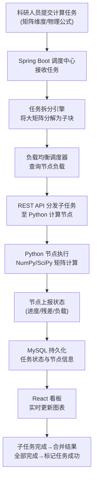

## 1. 产品概述
矩阵特征值并行计算调度平台，为实验室科研人员提供大规模矩阵分解与物理公式计算的分布式计算能力。平台将复杂计算任务拆分为子任务分发至多节点并行处理，通过可视化看板实时监控计算进度与系统负载。

### 目标用户
- 实验室科研人员：提交计算任务、监控计算进度、查看收敛结果
- 系统管理员：监控节点负载、管理计算资源

### 产品价值
- 提升大规模矩阵计算效率，通过并行计算缩短科研周期
- 实时可视化计算过程，便于科研人员分析收敛特性
- 自动负载均衡，最大化集群资源利用率

## 2. 核心功能

### 2.1 用户角色

| 角色 | 权限说明 |
|------|----------|
| 科研人员 | 提交计算任务、查看任务详情、监控收敛曲线 |
| 系统管理员 | 节点管理、任务调度配置、系统监控 |

### 2.2 功能模块

1. **计算任务管理**：任务提交、任务拆分、任务状态追踪
2. **节点调度系统**：节点注册、负载监控、智能分发
3. **科研监控看板**：任务进度可视化、残差收敛曲线、节点资源监控
4. **计算节点服务**：矩阵分解、特征值计算、物理公式求解

### 2.3 页面详情

| 页面名称 | 模块名称 | 功能描述 |
|---------|---------|----------|
| 集群任务看板 | 任务列表 | 展示所有计算任务的矩阵维度、当前状态、进度百分比 |
| 集群任务看板 | 收敛曲线图表 | 实时绘制每个任务的残差收敛曲线，支持多任务对比 |
| 集群任务看板 | 节点资源监控 | 条形图展示各 Python 计算节点的 CPU 和内存占用率 |
| 集群任务看板 | 任务详情面板 | 显示当前迭代步数、矩阵维度、计算节点分配信息 |

## 3. 核心流程

### 计算任务执行流程

## 4. 用户界面设计

### 4.1 设计风格
**严谨科研风格 (Scientific Rigor)**
- 主色调：深邃科技蓝 `#0F172A` 作为背景，辅以矩阵绿 `#10B981` 作为成功态，警戒橙 `#F59E0B` 作为运行态
- 字体：使用 `JetBrains Mono` 作为数据展示字体，确保数字等宽对齐；`Inter` 作为正文字体
- 视觉元素：网格背景、等宽数据表格、精密图表网格线
- 交互：冷静克制的过渡动画，数据更新时的轻微脉冲提示
- 整体氛围：专业、精密、可信赖的科研工具感

### 4.2 页面设计概览

| 页面名称 | 模块名称 | UI 元素 |
|---------|---------|----------|
| 集群任务看板 | 顶部状态栏 | 系统总负载、在线节点数、运行中任务数、告警指示器 |
| 集群任务看板 | 任务列表表格 | 任务ID、矩阵维度(N×N)、迭代步数/总步数、当前残差、状态标签、进度条 |
| 集群任务看板 | 收敛曲线图 | 双Y轴折线图，X轴迭代步数，Y轴残差(对数刻度)，多任务彩色曲线对比 |
| 集群任务看板 | 节点资源条 | 水平条形图分组，每组节点包含 CPU 占用条(蓝色) + 内存占用条(紫色)，实时更新 |
| 集群任务看板 | 任务详情抽屉 | 点击任务行展开，显示子任务分配、节点映射、收敛历史数据表 |

### 4.3 响应式
- Desktop-first 设计，针对 1920×1080 及以上分辨率优化
- 看板区域采用 CSS Grid 自适应布局，大屏可展示更多列
- 窄屏自动堆叠图表，保持可读性
- 数据表格支持横向滚动

## 5. 技术指标

| 指标 | 要求 |
|-----|------|
| 看板数据刷新间隔 | ≤ 3秒 |
| 单节点支持最大矩阵维度 | ≥ 10,000 × 10,000 |
| 并行节点数 | 支持 ≥ 16 节点同时计算 |
| 任务状态持久化 | MySQL 事务保证 |
| 收敛曲线数据点 | 每步存储，支持万级数据点渲染 |
