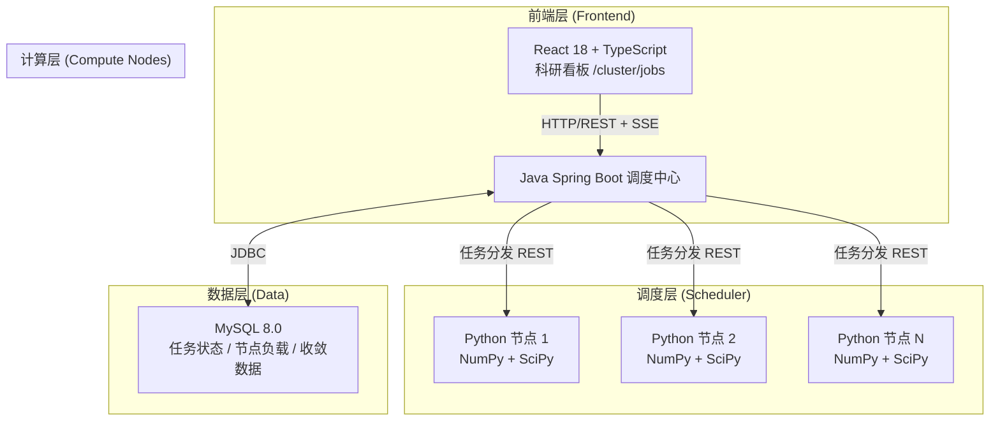
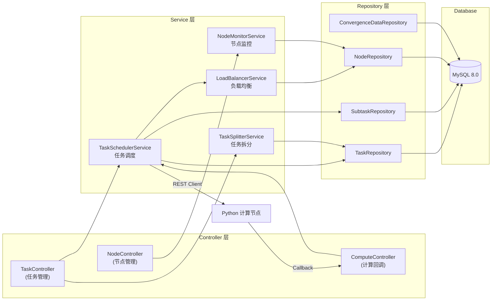
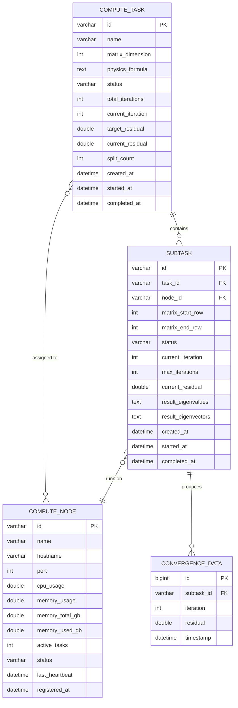

## 1. 整体架构设计



## 2. 技术栈说明

| 层级 | 技术选型 | 版本 | 用途 |
|-----|---------|------|------|
| 前端 | React | 18.x | UI 框架 |
| 前端 | TypeScript | 5.x | 类型安全 |
| 前端 | Vite | 5.x | 构建工具 |
| 前端 | TailwindCSS | 3.x | 样式框架 |
| 前端 | Recharts | 2.12.x | 图表库（收敛曲线、资源条） |
| 前端 | React Router | 6.x | 路由管理 |
| 前端 | Zustand | 4.x | 状态管理 |
| 前端 | Lucide React | 0.400.x | 图标库 |
| 调度层 | Java | 17 | JDK 版本 |
| 调度层 | Spring Boot | 3.2.x | 后端框架 |
| 调度层 | Spring Data JPA | 3.2.x | ORM 框架 |
| 调度层 | MySQL Connector | 8.3.x | JDBC 驱动 |
| 调度层 | Jackson | 2.16.x | JSON 序列化 |
| 计算层 | Python | 3.11 | 运行时 |
| 计算层 | NumPy | 1.26.x | 数值计算 |
| 计算层 | SciPy | 1.11.x | 科学计算（矩阵分解、特征值） |
| 计算层 | Flask | 3.0.x | REST API 服务 |
| 计算层 | psutil | 5.9.x | 系统资源监控 |
| 数据层 | MySQL | 8.0 | 关系型数据库 |

## 3. 项目目录结构

```
cj7/
├── frontend/                    # React 前端
│   ├── src/
│   │   ├── pages/
│   │   │   └── ClusterJobs.tsx  # /cluster/jobs 看板页面
│   │   ├── components/
│   │   │   ├── TaskTable.tsx    # 任务列表表格
│   │   │   ├── ConvergenceChart.tsx  # 收敛曲线图
│   │   │   ├── NodeResourceBar.tsx   # 节点资源条
│   │   │   ├── TaskDetailDrawer.tsx  # 任务详情抽屉
│   │   │   └── StatusHeader.tsx # 顶部状态栏
│   │   ├── store/
│   │   │   └── clusterStore.ts  # Zustand 状态管理
│   │   ├── types/
│   │   │   └── index.ts         # TypeScript 类型定义
│   │   ├── utils/
│   │   │   └── api.ts           # API 请求封装
│   │   ├── App.tsx
│   │   ├── main.tsx
│   │   └── index.css
│   ├── package.json
│   ├── vite.config.ts
│   └── tailwind.config.js
│
├── scheduler/                   # Java Spring Boot 调度中心
│   ├── src/main/java/com/lab/scheduler/
│   │   ├── SchedulerApplication.java
│   │   ├── controller/
│   │   │   ├── TaskController.java       # 任务管理 API
│   │   │   ├── NodeController.java       # 节点管理 API
│   │   │   └── ComputeController.java    # 计算结果回调 API
│   │   ├── service/
│   │   │   ├── TaskSchedulerService.java # 任务调度逻辑
│   │   │   ├── TaskSplitterService.java  # 任务拆分逻辑
│   │   │   ├── LoadBalancerService.java  # 负载均衡
│   │   │   └── NodeMonitorService.java   # 节点监控
│   │   ├── repository/
│   │   │   ├── TaskRepository.java
│   │   │   ├── SubtaskRepository.java
│   │   │   ├── NodeRepository.java
│   │   │   └── ConvergenceDataRepository.java
│   │   ├── entity/
│   │   │   ├── Task.java
│   │   │   ├── Subtask.java
│   │   │   ├── ComputeNode.java
│   │   │   └── ConvergenceData.java
│   │   ├── dto/
│   │   │   ├── request/
│   │   │   └── response/
│   │   └── config/
│   │       └── RestTemplateConfig.java
│   └── pom.xml
│
├── compute-node/                # Python 计算节点
│   ├── app.py                   # Flask 主程序
│   ├── compute/
│   │   ├── matrix_ops.py        # 矩阵运算封装
│   │   ├── eigenvalue.py        # 特征值计算
│   │   └── physics_solver.py    # 物理公式求解
│   ├── services/
│   │   ├── task_executor.py     # 任务执行器
│   │   └── resource_monitor.py  # 资源监控
│   ├── requirements.txt
│   └── config.py
│
└── database/
    └── init.sql                 # 数据库初始化脚本
```

## 4. 路由定义

| 路由 | 层级 | 说明 |
|-----|------|------|
| `/cluster/jobs` | 前端 | 科研监控看板主页面 |
| `/api/tasks` | 后端 | GET - 获取任务列表；POST - 提交新任务 |
| `/api/tasks/{id}` | 后端 | GET - 获取任务详情 |
| `/api/tasks/{id}/convergence` | 后端 | GET - 获取收敛曲线数据 |
| `/api/nodes` | 后端 | GET - 获取节点列表及负载 |
| `/api/nodes/{id}/heartbeat` | 后端 | POST - 节点心跳上报 |
| `/api/compute/submit` | 计算节点 | POST - 接收子任务计算请求 |
| `/api/compute/callback` | 后端 | POST - 计算结果回调 |

## 5. API 接口定义

### TypeScript 类型定义

```typescript
// 任务状态枚举
type TaskStatus = 'PENDING' | 'QUEUED' | 'RUNNING' | 'COMPLETED' | 'FAILED';

// 计算节点信息
interface ComputeNode {
  id: string;
  name: string;
  hostname: string;
  cpuUsage: number;      // 0-100
  memoryUsage: number;   // 0-100
  memoryTotalGB: number;
  memoryUsedGB: number;
  activeTasks: number;
  status: 'ONLINE' | 'OFFLINE' | 'BUSY';
  lastHeartbeat: string;
}

// 收敛数据点
interface ConvergencePoint {
  iteration: number;
  residual: number;
  timestamp: string;
  subtaskId?: string;
}

// 子任务信息
interface Subtask {
  id: string;
  taskId: string;
  matrixStartRow: number;
  matrixEndRow: number;
  nodeId: string;
  status: TaskStatus;
  currentIteration: number;
  maxIterations: number;
  currentResidual: number;
  convergenceHistory: ConvergencePoint[];
}

// 主任务信息
interface ComputeTask {
  id: string;
  name: string;
  matrixDimension: number;    // N x N
  physicsFormula: string;
  status: TaskStatus;
  totalIterations: number;
  currentIteration: number;
  targetResidual: number;
  currentResidual: number;
  progressPercent: number;
  subtasks: Subtask[];
  assignedNodes: string[];
  createdAt: string;
  startedAt?: string;
  completedAt?: string;
}

// 看板聚合数据
interface ClusterDashboardData {
  summary: {
    totalNodes: number;
    onlineNodes: number;
    runningTasks: number;
    pendingTasks: number;
    avgCpuUsage: number;
    avgMemoryUsage: number;
  };
  tasks: ComputeTask[];
  nodes: ComputeNode[];
}
```

### REST API 数据结构

```typescript
// POST /api/tasks - 提交任务请求
interface SubmitTaskRequest {
  name: string;
  matrixDimension: number;
  physicsFormula: string;
  targetResidual: number;
  maxIterations: number;
  splitCount: number;  // 拆分子任务数量
}

// POST /api/compute/submit - 计算节点接收子任务
interface ComputeSubtaskRequest {
  subtaskId: string;
  taskId: string;
  matrixData: number[][];
  physicsFormula: string;
  targetResidual: number;
  maxIterations: number;
  callbackUrl: string;
}

// POST /api/compute/callback - 计算结果回调
interface ComputeResultCallback {
  subtaskId: string;
  taskId: string;
  status: TaskStatus;
  eigenvalues: number[];
  eigenvectors: number[][];
  convergenceHistory: ConvergencePoint[];
  finalResidual: number;
  iterations: number;
  nodeId: string;
  computeTimeMs: number;
}
```

## 6. 服务端架构图



## 7. 数据模型

### 7.1 ER 图



### 7.2 DDL 语句

```sql
-- 创建数据库
CREATE DATABASE IF NOT EXISTS lab_matrix_scheduler
CHARACTER SET utf8mb4
COLLATE utf8mb4_unicode_ci;

USE lab_matrix_scheduler;

-- 计算节点表
CREATE TABLE compute_node (
    id VARCHAR(64) PRIMARY KEY,
    name VARCHAR(128) NOT NULL,
    hostname VARCHAR(256) NOT NULL,
    port INT NOT NULL,
    cpu_usage DOUBLE DEFAULT 0,
    memory_usage DOUBLE DEFAULT 0,
    memory_total_gb DOUBLE DEFAULT 0,
    memory_used_gb DOUBLE DEFAULT 0,
    active_tasks INT DEFAULT 0,
    status VARCHAR(32) NOT NULL DEFAULT 'OFFLINE',
    last_heartbeat DATETIME,
    registered_at DATETIME NOT NULL DEFAULT CURRENT_TIMESTAMP,
    INDEX idx_node_status (status),
    INDEX idx_heartbeat (last_heartbeat)
) ENGINE=InnoDB;

-- 计算任务表
CREATE TABLE compute_task (
    id VARCHAR(64) PRIMARY KEY,
    name VARCHAR(256) NOT NULL,
    matrix_dimension INT NOT NULL,
    physics_formula TEXT,
    status VARCHAR(32) NOT NULL DEFAULT 'PENDING',
    total_iterations INT NOT NULL,
    current_iteration INT DEFAULT 0,
    target_residual DOUBLE NOT NULL,
    current_residual DOUBLE,
    split_count INT NOT NULL DEFAULT 1,
    created_at DATETIME NOT NULL DEFAULT CURRENT_TIMESTAMP,
    started_at DATETIME,
    completed_at DATETIME,
    INDEX idx_task_status (status),
    INDEX idx_created_at (created_at)
) ENGINE=InnoDB;

-- 子任务表
CREATE TABLE subtask (
    id VARCHAR(64) PRIMARY KEY,
    task_id VARCHAR(64) NOT NULL,
    node_id VARCHAR(64),
    matrix_start_row INT NOT NULL,
    matrix_end_row INT NOT NULL,
    status VARCHAR(32) NOT NULL DEFAULT 'PENDING',
    current_iteration INT DEFAULT 0,
    max_iterations INT NOT NULL,
    current_residual DOUBLE,
    result_eigenvalues TEXT,
    result_eigenvectors TEXT,
    compute_time_ms BIGINT,
    created_at DATETIME NOT NULL DEFAULT CURRENT_TIMESTAMP,
    started_at DATETIME,
    completed_at DATETIME,
    FOREIGN KEY (task_id) REFERENCES compute_task(id) ON DELETE CASCADE,
    FOREIGN KEY (node_id) REFERENCES compute_node(id) ON DELETE SET NULL,
    INDEX idx_subtask_task (task_id),
    INDEX idx_subtask_node (node_id),
    INDEX idx_subtask_status (status)
) ENGINE=InnoDB;

-- 收敛数据表
CREATE TABLE convergence_data (
    id BIGINT AUTO_INCREMENT PRIMARY KEY,
    subtask_id VARCHAR(64) NOT NULL,
    iteration INT NOT NULL,
    residual DOUBLE NOT NULL,
    timestamp DATETIME NOT NULL DEFAULT CURRENT_TIMESTAMP,
    FOREIGN KEY (subtask_id) REFERENCES subtask(id) ON DELETE CASCADE,
    INDEX idx_conv_subtask (subtask_id),
    INDEX idx_conv_iteration (subtask_id, iteration)
) ENGINE=InnoDB;

-- 初始化测试节点数据
INSERT INTO compute_node (id, name, hostname, port, status, memory_total_gb) VALUES
('node-001', '计算节点-01', '192.168.1.101', 5000, 'ONLINE', 64),
('node-002', '计算节点-02', '192.168.1.102', 5000, 'ONLINE', 64),
('node-003', '计算节点-03', '192.168.1.103', 5000, 'ONLINE', 128),
('node-004', '计算节点-04', '192.168.1.104', 5000, 'ONLINE', 128);
```

## 8. Python 计算节点核心算法

### 矩阵特征值计算流程

```python
# 使用 NumPy + SciPy 实现的核心计算逻辑
# 1. 矩阵分解（LU/QR/SVD）
# 2. 迭代求解特征值（幂法、QR 算法、Lanczos 算法）
# 3. 残差计算与收敛判断
# 4. 物理公式求解（薛定谔方程、哈密顿量等）

from numpy import linalg as LA
from scipy.linalg import eigh, lu_factor, lu_solve
from scipy.sparse.linalg import eigsh, svds

def compute_eigenvalues(matrix, target_residual=1e-8, max_iter=1000):
    """计算对称矩阵的特征值与特征向量"""
    # 使用 SciPy 的 eigh 求解对称矩阵
    eigenvalues, eigenvectors = eigh(
        matrix,
        subset_by_index=[0, min(10, matrix.shape[0]-1)],  # 最小的10个特征值
        maxiter=max_iter,
        tol=target_residual
    )
    return eigenvalues, eigenvectors

def iterative_solver(matrix, formula, target_residual, max_iter):
    """迭代求解器，带收敛追踪"""
    convergence_history = []
    current_matrix = matrix.copy()
    
    for i in range(max_iter):
        # 执行物理公式对应的计算
        result = apply_physics_formula(current_matrix, formula)
        
        # 计算残差
        residual = calculate_residual(result, current_matrix)
        convergence_history.append({
            'iteration': i + 1,
            'residual': float(residual),
            'timestamp': datetime.now().isoformat()
        })
        
        # 收敛判断
        if residual < target_residual:
            break
            
        # 更新矩阵用于下一次迭代
        current_matrix = update_matrix(current_matrix, result)
    
    return result, convergence_history
```

## 9. 实时数据推送方案

- 前端使用 **3秒轮询** + **SSE (Server-Sent Events)** 混合方案
- 任务状态变化通过 SSE 主动推送
- 收敛曲线数据通过轮询获取（数据量较大）
- 节点负载数据每2秒刷新一次

## 10. 部署与启动

### 端口分配

| 服务 | 端口 |
|-----|------|
| React 前端 | 5173 |
| Spring Boot 调度中心 | 8080 |
| Python 计算节点 1 | 5000 |
| Python 计算节点 2 | 5001 |
| MySQL | 3306 |
